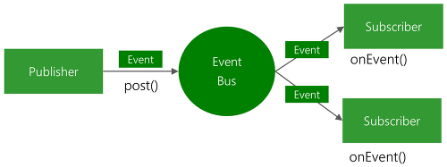
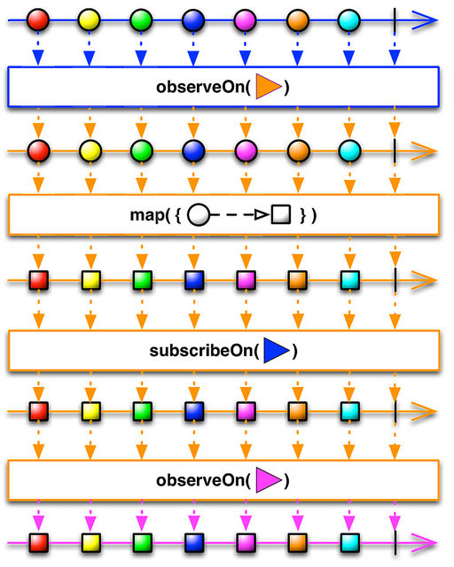

# EventBus 와 RxJava



안드로이드에서 컴포넌트간 커뮤니케이션을 간편하게 해준다.
이벤트를 주고 받는 컴포넌트의 관계를 알아서 맺어준다.
백그라운드 쓰레드와 액티비티, 프레그먼트에서 잘 동작한다.
복잡하고 에러나기 쉬운 생명주기 이슈를 피할 수 있게 해준다.

## 이벤트 버스 이용한는 법

> 이벤트를 정의하고:

    public class MessageEvent { /* Additional fields if needed */ }

> 이벤트 구독자를 지정:

    eventBus.register(this);
    public void onEvent(AnyEventType event) {/* Do something */};

> 이벤트 전달:

    eventBus.post(event);

출처: http://c-o-e.tistory.com/78

# RxJava를 이용한 EventBus 구현

## 1. EventBus처럼 구독 가능한 PublishSubject 객체를 가지고 있는 Singleton 클래스를 만든다.

```java
public class RxEventBus {
    private final PublishSubject<Object> mSubject;
    interface Holder {
        RxEventBus instance = new RxEventBus();
    }
    public static RxEventBus getInstance() {
        return Holder.instance;
    }

    private RxEventBus() {
        mSubject = PublishSubject.create();
    }
}
```

## 2. Event를 구독하고 발행도 할 수 있도록 메소드를 추가. (Object 인자는 다른 것으로 변경 가능)
```java
public void sendEvent(Object object) {
    mSubject.onNext(object);
}
public Observable<Object> getObservable() {
    return mSubject;
}
```

## 3. Event 발행하기

Eventbus를 사용할 곳(ex. Activity) 에서 Event를 발행할 수 있다.

```java
@Override
public void onClick(View v) {   // Activity에서 버튼 클릭 이벤트를 받는다고 가정.
    TextView tv = (TextView) findViewById(R.id.text);
    RxEventBus.getInstance().sendEvent(tv.getText().toString());
}
```

## 4. Event 구독하기

Event를 받을 곳(ex. Fragment) 에서 Event를 구독하고, Event가 발생할때 마다 동작한다.

```java
Subscription s = RxEventBus.getInstance().getObservable()
    .subscribe(
        o -> Toast.makeText(mContext, (String)o, Toast.LENGTH_SHORT).show(), // 매개변수가 1개인 함수에 바로 변수를 연결시켜줄 때는 this::handleEvent, 와 같이 사용할 수 있다.
        error -> Log.d(TAG, "onError()"), 
        () -> Log.d(TAG, "onCompleted()")
    );
```

```java
//Lambda를 사용하지 않은 형태
Subscription s = RxEventBus.getInstance().getObservable()
.subscribe(new Subscriber<Object>() {
   @Override
   public void onNext(Article article) {
       // this can be called multiple times
   }
   @Override
   public void onError(Throwable e) {
       // no more events, and automatically unsubscribed
   }
   @Override
   public void onCompleted() {
       // no more events, and automatically unsubscribed
   }
});
```

subscribe()에서 순서대로 onNext(), onError(), onCompleted() 세 가지를 모두 사용했지만,
onNext()만 사용할 수도 있고, onNext()와 onError()만 사용할 수도 있는 interface가 있으니,
필요에 맞게 사용하시면 됩니다.
(TIP, onNext()만 사용하다가 error가 발생하면 app이 죽을 수 있으니, 최소한 onError()까지 처리를 해줍시다.)

## 5. Event 구독 해제

스트림 작업을 완료하면 구독을 해제해야 합니다. 예를 들어 프래그먼트나 액티비티를 사용하는 경우 생명주기를 처리하던 구독을 중지한다면 이벤트를 만드는 옵저버블을 취소해야겠죠. 구독을 취소하지 않는다면 메모리 누출이 생길 수 있습니다. 

```java
s.unsubscribe();
```

> RxJava2에서 Subscription이 Disposable로 변경되었다. Disposable.dispose();로 구독을 해제하거나, CompositeDisposable를 이용한다.
```java
private final CompositeDisposable disposables = new CompositeDisposable();
disposables.add('subscribe후 나오는 Disposable');
disposables.clear(); // 또는 disposables.dispose();
```
- https://stackoverflow.com/questions/39203791/how-to-use-compositedisposable-of-rxjava-2

참고로 [RxLifeCycle](https://github.com/trello/RxLifecycle)라는 Library도 있음.

## 6. 구독한 데이터 가공하기

옵저버블 자체는 간단하지만 오퍼레이터를 사용해서 스트림을 조작하는데서 그 강력한 기능이 생겨납니다. 많은 오퍼레이터들이 있고 이를 조합할 방법도 다양합니다.
map은 한 데이터를 다른 데이터로 바꾸는 오퍼레이터입니다. 원본의 데이터는 변경하지 않고 새로운 스트림을 만들어 냅니다. 
```java
Subscription s = RxEventBus.getInstance().getObservable()
    .map(o -> o + ", Event Received.")
    .subscribe(
        s -> Toast.makeText(mContext, (String)s, Toast.LENGTH_SHORT).show(), 
        error -> Log.d(TAG, "onError()")
    );
```

[오퍼레이터 사용 팁](http://reactivex.io/documentation/operators.html)

## 7. 스케쥴러 지정

```java
Subscription s = RxEventBus.getInstance().getObservable()
    .observeOn(Schedulers.io())
    .subscribeOn(AndroidSchedulers.mainThread())
    .map(o -> o + ", Event Received.")
    .subscribe(
        s -> Toast.makeText(mContext, (String)s, Toast.LENGTH_SHORT).show(), 
        error -> Log.d(TAG, "onError()")
    );
```

스케쥴러는 해당 옵저버블, 오퍼레이터, 서브스크라이버를 어떤 스레드에서 수행할지 결정하는 것입니다.

subsctibeOn()은 observable의 작업을 시작하는 쓰레드를 선택 할 수 있습니다.
중복해서 적을 경우 가장 마지막에 적힌 스레드에서 시작합니다.

observeOn()은 이후에 나오는 오퍼레이터, subscribe의 스케쥴러를 변경 할 수 있습니다.



위 그림에서 subscribeOn은 시작하는 스케쥴러를 나타내는데, subscribeOn 호출 시점과 상관없이 적용됩니다. observeOn은 호출 시점 아래의 스케쥴러가 영향을 받은 것을 알 수 있습니다.

스케쥴러는 RxJava가 제공하는 스케쥴러와 RxAndroid가 제공하는 스케쥴러가 있습니다. 먼저 RxJava가 제공하는 스케쥴러를 살펴봅시다.

- Schedulers.computation() - 이벤트 룹에서 간단한 연산이나 콜백 처리를 위해서 쓰는 것입니다. I/O 처리를 여기에서 해서는 안됩니다.
- Schedulers.from(executor) - 특정 executor를 스케쥴러로 사용합니다.
- Schedulers.immediate() - 현재 스레드에서 즉시 수행합니다.
- Schedulers.io() - 동기 I/O를 별도로 처리시켜 비동기 효율을 얻기 위한 스케줄러입니다. 자체적인 스레드 풀에 의존합니다.
- Schedulers.newThread() - 항상 새로운 스레드를 만드는 스케쥴러입니다.
- Schedulers.trampoline() - 큐에 있는 일이 끝나면 이어서 현재 스레드에서 수행하는 스케쥴러.

일부 오퍼레이터들은 자체적으로 어떤 스케쥴러를 사용할지 지정합니다. 예를 들어 buffer 오퍼레이터는 Schedulers.computation()에 의존하며 repeat은 Schedulers.trampoline()를 사용합니다.

RxAndroid는 아래와 같은 스케쥴러를 추가합니다.

- AndroidSchedulers.mainThread() - 안드로이드의 UI 스레드에서 동작합니다.
- HandlerScheduler.from(handler) - 특정 핸들러 handler에 의존하여 동작합니다.

안드로이드에 특화된 스케쥴러입니다. 보통은 RxAndroid가 제공하는 AndroidSchedulers.mainThread()와 RxJava가 제공하는 Schedulers.io()를 조합해서 Schedulers.io()에서 수행한 결과를 AndroidSchedulers.mainThread()에서 받아 UI에 반영하는 패턴등이 일반적으로 쓰입니다.


## Appendix 1. Flowable

Flowable은 Observable의 Backpressure문제를 해결하기 위해 RxJava2에서 나왔다.
Backpressure 문제란 병목현상과 같이 발행보다 구독처리가 늦어지면서 data가 쌓여 발생하는 문제이다.
아래 와 같이 Observable을 .toFlowable()로 변경 가능하다. 
```java
Disposable d = RxEventBus.getInstance().getObservable().toFlowable(BackpressureStrategy.LATEST)
    .map(o -> o + ", Event Received.")
    .subscribe(
        s -> Toast.makeText(mContext, (String)s, Toast.LENGTH_SHORT).show(), 
        error -> Log.d(TAG, "onError()")
    );
```

<출처>
- http://developer88.tistory.com/128
- http://blog.fobid.me/2
- https://academy.realm.io/kr/posts/mobilization-hugo-visser-rxjava-for-rest-of-us/
- https://academy.realm.io/kr/posts/rxandroid2/
- http://tiii.tistory.com/18 (스케쥴링)

- https://blog.mindorks.com/understanding-rxjava-subject-publish-replay-behavior-and-async-subject-224d663d452f (Subject)